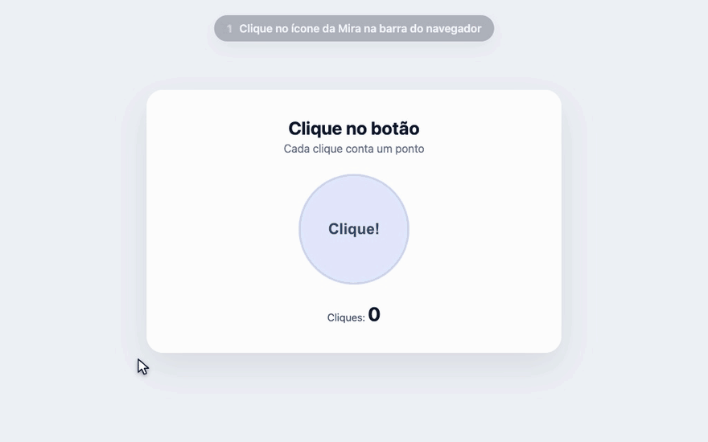

# Mira – Auto Clicker

Marque um ponto da página e a Mira clica ali sozinha, sem parar, no intervalo que você escolher.

Funciona de dois jeitos:

- **Extensão para Brave e Chrome**: clica no ícone, marca o ponto e aperta Iniciar.
- **Pelo terminal (macOS)**: controla um navegador que já está aberto, sem abrir outro.



## O que ela faz

- Mira fixa num ponto da tela: você marca uma vez e ela clica sempre ali.
- Marca o ponto apertando **M** com o mouse em cima, ou pelo botão **Marcar ponto**.
- Ajuste fino: arraste a mira, ou clique nela e use as setas (1 px; com Shift, 10 px).
- Intervalo livre (mínimo de 10 ms), com atalhos de 50, 100, 250 e 500 ms e 1 s.
- Contador de cliques e de cliques por segundo.
- Painel que se arrasta pelo topo, recolhe no **–** e sai sozinho da frente do ponto marcado.
- Lembra o ponto e o intervalo de cada site.
- Começa cada rodada com um duplo clique (e repete depois de pausas de 2 s ou mais), para players de vídeo de lives que só aceitam cliques simples depois de um duplo clique.

## Extensão (Brave e Chrome)

### Instalar

1. Baixe este repositório (botão **Code → Download ZIP**) e descompacte.
2. Abra a página de extensões do navegador:
   - Brave: `brave://extensions`
   - Chrome: `chrome://extensions`
3. Ligue o **Modo do desenvolvedor** (canto superior direito).
4. Clique em **Carregar sem compactação** e escolha a pasta [`extensao`](extensao).
5. Pelo ícone de quebra-cabeça da barra, fixe a Mira para o ícone ficar sempre à vista.

Guarde a pasta num lugar fixo: se ela for apagada ou movida, a extensão some do navegador.

### Usar

1. Na página, clique no ícone da Mira (ou use **Alt+Shift+A**, que no Mac é **Option+Shift+A**). O painel aparece no canto da tela.
2. Passe o mouse em cima do ponto e aperte **M**.
3. Aperte **Iniciar**. Para parar, **Parar**. Para fechar, o **×** do painel ou o ícone de novo.

| No painel | O que faz |
| --- | --- |
| **M** (com o mouse sobre o ponto) | Marca o ponto onde o mouse está (não vale dentro de campo de texto) |
| **Marcar ponto** / **Remarcar** | Escurece a tela e marca no próximo clique; **Esc** cancela |
| Arrastar a mira | Muda o ponto |
| Clicar na mira + setas | Move 1 px (com Shift, 10 px) |
| Campo **Intervalo** e atalhos | Tempo entre cliques |
| **–** | Recolhe o painel |
| Arrastar o topo do painel | Muda o painel de lugar |

Observações:

- Se a página recarregar, o painel fecha: é só clicar no ícone de novo. O ponto e o intervalo voltam.
- Páginas internas do navegador (`chrome://`, `brave://`, a loja de extensões) não deixam extensões rodarem. Nelas o ícone mostra um **!**.
- A extensão pede só `activeTab` e `scripting`: ela só mexe na aba em que você clicou no ícone e não coleta nenhum dado.

## Terminal (macOS)

Controla pelo terminal um navegador baseado em Chromium que já esteja aberto (Brave, Chrome, Edge, Vivaldi ou Chromium).

### Requisitos

- macOS e Node.js 18 ou mais novo.
- No navegador, uma vez só: **Ver → Desenvolvedor → Permitir o JavaScript dos Eventos da Apple**.

### Usar

```bash
node autoclick.mjs -n brave
```

Deixe a aba onde quer clicar na frente, digite `m` no terminal e clique no ponto (ou aperte **M** com o mouse em cima). Depois, **Enter** inicia e para.

| Opção | O que faz |
| --- | --- |
| `-n, --navegador <nome>` | `brave`, `chrome`, `edge`, `vivaldi` ou `chromium` (sem isso, usa o que estiver aberto ou pergunta) |
| `-i, --intervalo <ms>` | Tempo entre cliques (padrão 500) |
| `-m, --max <n>` | Para sozinho depois de *n* cliques |
| `-h, --ajuda` | Mostra a ajuda |

| Comando | O que faz |
| --- | --- |
| `m`, `marcar` | Traz o navegador para a frente para você clicar no ponto |
| `ponto <x> <y>` | Põe a mira numa coordenada exata |
| Enter | Inicia / para |
| `t`, `intervalo <ms>` | Muda o intervalo |
| `x`, `max <n>` | Para sozinho depois de *n* cliques (0 = sem limite) |
| `s`, `status` | Mostra aba, ponto, intervalo e cliques |
| `aba` | Passa a usar a aba que está na frente |
| `abas` | Lista as abas abertas; `aba <número>` escolhe uma |
| `?`, `ajuda` | Lista os comandos |
| `q`, `sair` | Para, tira a mira da página e sai |

Se a página recarregar, o terminal coloca a mira de volta e continua clicando.

## Como funciona

- A cada intervalo, a Mira pega o elemento que está debaixo do ponto (`document.elementFromPoint`) e dispara nele `mousedown`, `mouseup` e `click`. No primeiro clique da rodada, e depois de uma pausa de 2 s ou mais, ela manda um segundo clique e um `dblclick`.
- O relógio dos cliques roda num Web Worker (com `setInterval` de reserva), para sofrer menos com a economia de energia das abas em segundo plano.
- O painel e a mira ficam num Shadow DOM, sem misturar com o CSS da página, e os cliques atravessam o painel quando ele está por cima do ponto.
- A extensão injeta o mesmo script ([`extensao/autoclick.js`](extensao/autoclick.js)) quando você clica no ícone.
- O terminal usa JavaScript for Automation (`osascript -l JavaScript`), fala com o navegador pelo PID (assim nunca abre outro) e roda o mesmo script na aba escolhida.

## Estrutura

```
autoclick.mjs        controle pelo terminal (macOS)
extensao/            a extensão (é esta pasta que se carrega no navegador)
  manifest.json
  background.js      abre e fecha o painel pelo ícone
  autoclick.js       painel, mira e cliques (usado também pelo terminal)
  icons/
loja/                imagens e textos prontos para a Chrome Web Store
docs/demo.gif        a demonstração acima
```

## Gerar o zip

```bash
npm run zip
```

Gera `loja/mira-chrome-web-store.zip`, que serve tanto para enviar à Chrome Web Store quanto para mandar a alguém instalar (descompactar e carregar a pasta, como no passo a passo acima). Para publicar na loja, os textos e as imagens estão em [`loja/`](loja).

A cada versão nova, suba o `version` do [`manifest.json`](extensao/manifest.json) antes de gerar o zip. Quem instalou pela pasta só precisa trocar os arquivos e clicar no botão de recarregar da extensão.
